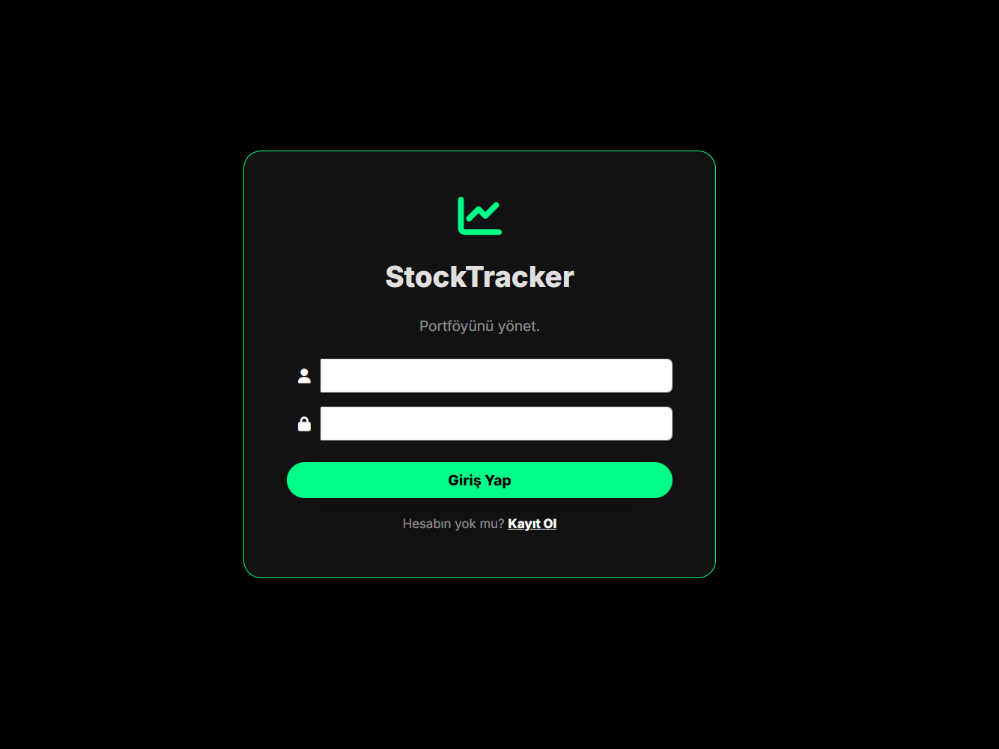
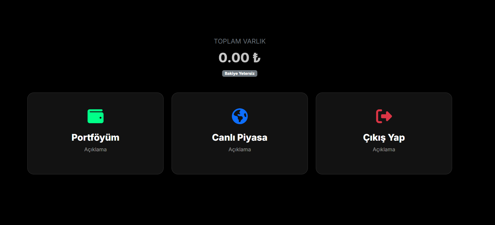
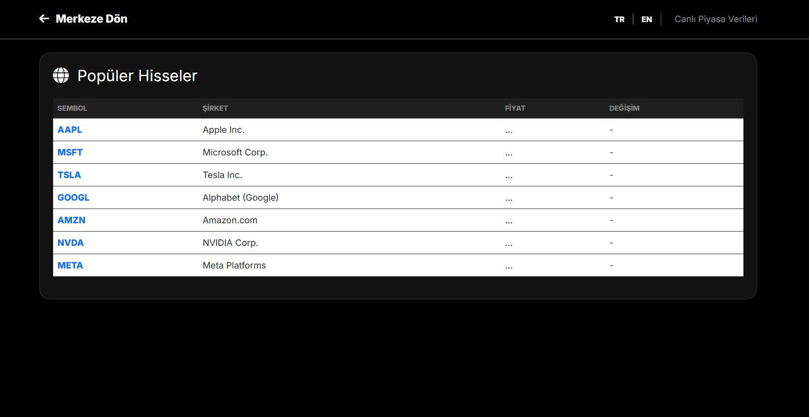
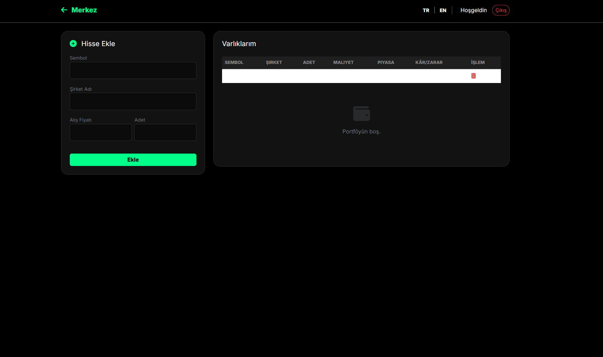

# 📈 StockTracker - Kişisel Borsa Portföy Takip Uygulaması

Bu proje, Spring Boot ve Thymeleaf kullanılarak geliştirilmiş, canlı borsa verilerini takip eden ve portföy kâr/zarar analizi yapan modern bir web uygulamasıdır.

## 🚀 Özellikler

* **Canlı Veri:** Finnhub API entegrasyonu ile anlık hisse fiyatı takibi.
* **Akıllı Portföy Yönetimi:** Aynı hisse eklendiğinde "Ağırlıklı Ortalama Maliyet" (Weighted Average Cost) hesaplaması.
* **Modern Arayüz:** Glassmorphism tasarımı, Dark Mode ve jQuery Autocomplete ile kullanıcı dostu deneyim.
* **Dinamik Dil Desteği:** Türkçe ve İngilizce (i18n) desteği.
* **Veritabanı:** PostgreSQL ile güvenli veri saklama.

## 🛠️ Teknolojiler

* **Backend:** Java 17, Spring Boot 3, Spring Data JPA
* **Frontend:** Thymeleaf, Bootstrap 5, JavaScript (jQuery), Chart.js
* **Database:** PostgreSQL
* **Tools:** Maven, Lombok

## 📸 Ekran Görüntüleri

## 📦 Kurulum

1.  Repoyu klonlayın.
2.  PostgreSQL'de `stocktracker_db` adında bir veritabanı oluşturun.
3.  `application.properties` dosyasında veritabanı bilgilerinizi girin.
4.  Finnhub'dan aldığınız API Key'i `StockService` içine ekleyin.
5.  `mvn spring-boot:run` ile çalıştırın.